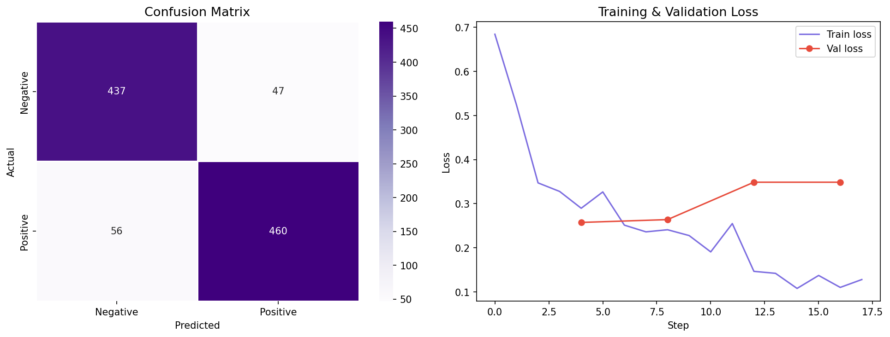

# IMDB Sentiment Analysis with DistilBERT

A modern Natural Language Processing project that performs **binary sentiment classification** (Positive/Negative) on IMDB movie reviews using **DistilBERT** (fine-tuned) with a **TF-IDF + Logistic Regression** baseline for comparison.



## ✨ Features

- Fine-tuning of **DistilBERT** using Hugging Face Transformers
- TF-IDF + Logistic Regression baseline model
- Comprehensive Exploratory Data Analysis (EDA)
- Interactive **Streamlit Web Application** for real-time inference
- Detailed model evaluation (Accuracy, F1-score, Classification Report)
- Apple Silicon (MPS) support
- Clean and organized project structure

## 📊 Results

| Model                          | Accuracy | F1 Score | Improvement |
|-------------------------------|----------|----------|-------------|
| TF-IDF + Logistic Regression  | 85.90%   | 85.88%   | -           |
| **DistilBERT (Fine-tuned)**   | **89.70%** | **89.70%** | **+3.80%**  |

**Best Model:** DistilBERT (Accuracy: **0.8970**)

## 🛠️ Tech Stack

- **Python** 3.10+
- **PyTorch** 2.2.2 (MPS support)
- **Hugging Face Transformers** 4.40.0
- **Datasets** 2.18.0
- **Accelerate** 0.29.3
- **Streamlit** 1.33.0
- **scikit-learn**, **pandas**, **matplotlib**, **seaborn**, **wordcloud**

## 📁 Project Structure

```bash
NLP_Project/
├── rawData/
│   └── IMDB Dataset.csv
├── sentiment_model/          # Fine-tuned DistilBERT model
├── results/                  # Training checkpoints
├── venv/
├── .gitignore
├── app.py                    # Streamlit Web Application
├── sentiment_analysis.py     # Training & Evaluation pipeline
├── requirements.txt
├── eda_overview.png
├── results.png
├── wordclouds.png
└── README.md
